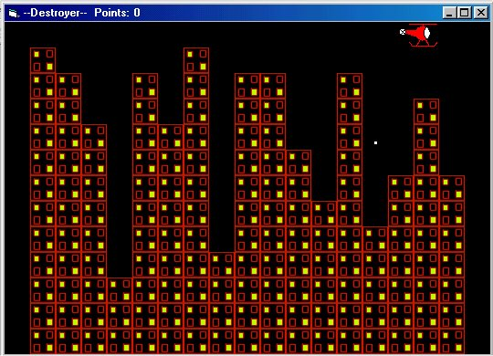



## Destroyer \(Helicopter Game\)

### Description

This is a simple helicopter game I made using BitBlt. The point of the game is to destroy all the buildings on the screen, and then carry on with the next structure. But this time, with the helicopter moving faster. Thanks to Tim Miron for submitting a tutorial on BitBlt on this site. I had to give him credit because his code was of great help when I made this.
 
### More Info
 

             |
---                |---
**Submitted On**   |2003-01-29 22:56:44
**By**             |[Dino Scarcella](https://github.com/Planet-Source-Code/PSCIndex/blob/master/ByAuthor/dino-scarcella.md)
**Level**          |Intermediate
**User Rating**    |3.3 (13 globes from 4 users)
**Compatibility**  |VB 6\.0
**Category**       |[Games](https://github.com/Planet-Source-Code/PSCIndex/blob/master/ByCategory/games__1-38.md)
**World**          |[Visual Basic](https://github.com/Planet-Source-Code/PSCIndex/blob/master/ByWorld/visual-basic.md)
**Archive File**   |[Destroyer\_1536621302003\.zip](https://github.com/Planet-Source-Code/dino-scarcella-destroyer-helicopter-game__1-42807/archive/master.zip)

